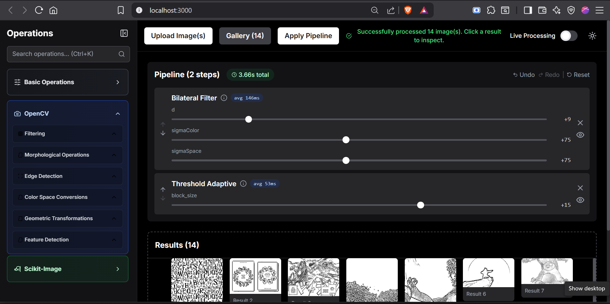

#  PixelFlow

## Visual Image Processing Pipeline Builder

---

### A comprehensive web application that enables developers and researchers to build, test, and apply sophisticated image processing pipelines through an intuitive visual interface.

PixelFlow eliminates the need for manual parameter tuning by providing **real-time visual feedback** and extensive operation libraries from **OpenCV** and **Scikit-Image**.



---

## 📋 Table of Contents

- [Features](#-features)
- [Architecture](#️-architecture)
- [Quick Start](#-quick-start)
- [Installation](#️-installation)
- [Usage](#-usage)
- [API Documentation](#-api-documentation)
- [Operations Library](#-operations-library)
- [Performance](#-performance)
- [Contributing](#-contributing)

---

#  Features

## Core Functionality

### **Visual Pipeline Builder**

- **Parameter Controls**: Real-time slider and dropdown controls for all operations
- **Pipeline Management**: Add, remove, reorder, and modify operations seamlessly

### **Dual Processing Modes**
- **Live Mode**: Instant processing with immediate visual feedback for single images
- **Batch Mode**: Efficient processing of multiple images with detailed progress tracking
- **Step Preview**: Individual pipeline step inspection and debugging capabilities

### **Comprehensive Operations Library**
- **50+ Operations**: Industry-standard algorithms from OpenCV and Scikit-Image
- **Hierarchical Organization**: Logical categorization by library, category, and operation type
- **Performance Optimized**: Efficient implementations with timing analysis


## Developer Experience

### **Performance Analytics**
- **Real-time Timing**: Millisecond-precision performance metrics for every operation
- **Pipeline Optimization**: Total execution time tracking with step-by-step breakdowns
- **Batch Analysis**: Average processing times across multiple images

### **Advanced Workflow Features**
- **Undo/Redo System**: Complete operation history with keyboard shortcuts (Ctrl+Z/Ctrl+Y)
- **Method Documentation**: Comprehensive technical documentation for every operation
- **Session Management**: Automatic file cleanup and isolated user sessions

### **Professional Interface**
- **Modern Design**: Clean, responsive interface with dark/light theme support
- **Image Gallery**: Advanced masonry layout with lightbox viewing capabilities
- **Comparison Tools**: Side-by-side and slider comparison views for detailed result analysis

---

#  Architecture


PixelFlow follows a **modern, scalable architecture** designed for maintainability and performance:

```
┌─────────────────────┐    ┌────────────────────────┐    ┌─────────────────────┐
│                     │    │                        │    │                     │
│   REACT CLIENT      │    │   FASTAPI SERVER       │    │   IMAGE STORAGE     │
│                     │    │                        │    │                     │
│ • TypeScript        │◄──►│ • Python 3.8+          │◄──►│ • Session-based     │
│ • Tailwind CSS      │    │ • OpenCV               │    │ • Auto-cleanup      │
│ • Custom Hooks      │    │ • Scikit-Image         │    │ • Local files       │
│ • State Management  │    │ • Performance Tracking │    │ • Secure isolation  │
│                     │    │                        │    │                     │
└─────────────────────┘    └────────────────────────┘    └─────────────────────┘
```

## 🔧 Technology Stack

### **Frontend Technologies**
| Technology | Version | Purpose |
|------------|---------|---------|
| **React** | 18.2+ | Component-based UI with hooks |
| **TypeScript** | 4.9+ | Type-safe development |
| **Tailwind CSS** | 3.3+ | Utility-first styling |
| **Axios** | 1.5+ | HTTP client with interceptors |
| **Lucide React** | 0.263+ | Professional icon library |

### **Backend Technologies**
| Technology | Version | Purpose |
|------------|---------|---------|
| **FastAPI** | 0.104+ | High-performance API framework |
| **OpenCV** | 4.8+ | Computer vision and image processing |
| **Scikit-Image** | 0.22+ | Scientific image analysis |
| **PIL/Pillow** | 10.1+ | Image manipulation and formats |
| **NumPy** | 1.24+ | Numerical computing foundation |

---

##  Design Patterns

### **Session-based Architecture**
- Isolated user sessions with automatic cleanup
- Secure file handling with configurable timeouts
- Memory management and resource optimization

### **Modular Operation System**  
- Extensible operation library with standardized interfaces
- Plugin-like architecture for easy addition of new operations
- Consistent parameter handling across all operations

### **Performance Monitoring**
- Built-in timing and profiling for optimization
- Real-time performance feedback
- Comprehensive error tracking and reporting

---

#  Quick Start


## Installation Steps

### **1️⃣ Clone Repository**
```bash
git clone https://github.com/MauryanTitans/pixelflow.git
cd pixelflow
```

### **2️⃣ Backend Setup**
```bash
cd backend

# Create virtual environment (recommended)
python -m venv env

# Activate virtual environment
# Windows:
.\env\Scripts\activate
# macOS/Linux:
source env/bin/activate

# Install dependencies
pip install -r requirements.txt

# Start backend server
python run.py
```

### **3️⃣ Frontend Setup**
```bash
# In a new terminal window
cd frontend

# Install dependencies
npm install

# Start development server
npm start
```

### **4️⃣ Access Application**

| Service | URL | Description |
|---------|-----|-------------|
| **Frontend** | http://localhost:3000 | Main application interface |
| **API Docs** | http://localhost:8000/docs | Interactive API documentation |
| **Health Check** | http://localhost:8000/health | Backend status monitoring |

---

## Installation

### Backend Installation

1. **Create Virtual Environment** (recommended)
   ```bash
   python -m venv env
   # Windows
   .\env\Scripts\activate
   # macOS/Linux
   source env/bin/activate
   ```

2. **Install Dependencies**
   ```bash
   cd backend
   pip install -r requirements.txt
   ```

3. **Verify Installation**
   ```bash
   python -c "import cv2, skimage, PIL; print('All dependencies installed successfully')"
   ```

### Frontend Installation

1. **Install Node Dependencies**
   ```bash
   cd frontend
   npm install
   ```

2. **Configure Environment** (optional)
   ```bash
   # Create .env file for custom API URL
   echo "REACT_APP_API_URL=http://localhost:8000/api" > .env
   ```

### Development Tools

- **API Testing**: Use the interactive documentation at `/docs`
- **Session Monitoring**: Check `/api/images/session-stats` for debug information
- **Performance Analysis**: Built-in timing data in all API responses
---
#  Usage


##  Basic Workflow

### **Step 1: Upload Images**
- Click **"Upload Image(s)"** button or drag files directly to the interface
- **Supported Formats**: JPEG, PNG, BMP, TIFF (up to 50MB per file)
- **Batch Upload**: Select multiple images simultaneously for batch processing

### **Step 2: Build Your Pipeline**
- **Browse Operations**: Navigate the organized operation library in the left sidebar
- **Add Operations**: Click any operation to add it to your pipeline
- **Adjust Parameters**: Use real-time sliders and dropdowns to fine-tune settings
- **Reorder Steps**: Drag operations up/down to change processing order

### **Step 3: Choose Processing Mode**

| Mode | Best For | Features |
|------|----------|----------|
| **🔴 Live Mode** | Single image experimentation | Real-time preview, instant feedback |
| **⚡ Batch Mode** | Multiple image processing | Progress tracking, efficient processing |

### **Step 4: Apply and Review**
- **Process Images**: Click "Apply Pipeline" for batch or enable Live Mode for real-time
- **Inspect Results**: Use multiple viewing modes (normal, side-by-side, slider comparison)
- **Download Results**: Save individual images or entire processed batches

---

##  Advanced Features

###  Keyboard Shortcuts
```
Ctrl+Z    → Undo last pipeline change
Ctrl+Y    → Redo pipeline change  
Ctrl+K    → Focus operation search
Escape    → Close active modals
```

### Performance Monitoring
- **Pipeline Header**: Total execution time display
- **Step-by-Step**: Individual operation timing analysis
- **Optimization Guidance**: Identify bottlenecks and optimize workflows

###  Method Documentation
- **Info Icons**: Click ℹ️ next to operation names for detailed documentation
- **Parameter Guides**: View ranges, technical details, and usage recommendations
- **Algorithm Explanations**: Access comprehensive technical information

---

#  API Documentation


##  Core Endpoints

### **Image Management**

#### Upload Single Image
```http
POST /api/images/upload
Content-Type: multipart/form-data

Parameters:
├── file: Image file (JPEG, PNG, BMP, TIFF) - Max 50MB
└── session_id: Unique session identifier
```

#### Batch Image Upload
```http
POST /api/images/upload-multiple
Content-Type: multipart/form-data

Parameters:
├── files: Multiple image files (Max 20 files)
└── session_id: Session identifier
```

---

### **Processing Operations**

#### Batch Processing
```http
POST /api/processing/process
Content-Type: application/json

{
  "image_ids": ["uuid1", "uuid2", "uuid3"],
  "pipeline": [
    {
      "name": "Brightness",
      "params": {"amount": 25}
    },
    {
      "name": "Gaussian Blur", 
      "params": {"radius": 3}
    }
  ],
  "session_id": "session_12345"
}
```

#### Live Processing
```http
POST /api/processing/process-live
Content-Type: application/json

{
  "image_id": "single_uuid",
  "pipeline": [
    {
      "name": "Contrast",
      "params": {"amount": 50}
    }
  ],
  "session_id": "session_12345"
}
```

---

##  Response Format

### **Standard Response Structure**
All API responses include comprehensive **timing data** and **detailed feedback**:

```json
{
  "success": true,
  "processed_images": ["base64_encoded_image_data"],
  "total_time": 0.245,
  "step_timings": [
    {
      "step_name": "Brightness",
      "duration": 0.123,
      "step_index": 0
    },
    {
      "step_name": "Gaussian Blur",
      "duration": 0.089,
      "step_index": 1
    }
  ],
  "message": "Successfully processed 3 image(s)"
}
```

### **Error Response Structure**
```json
{
  "success": false,
  "error": "Processing failed",
  "message": "Invalid image format: RGBA images automatically converted to RGB",
  "details": "Specific error details for debugging"
}
```

---

#  Operations Library

---

PixelFlow provides **50+ professional-grade operations** organized into three comprehensive libraries:

##  Basic Operations (13 operations)
**Essential image adjustments and filters for common use cases**

| Category | Operations | Use Cases |
|----------|------------|-----------|
| **Adjustments** | Brightness, Contrast, Saturation, Exposure | Basic image correction and enhancement |
| **Filters** | Grayscale, Sepia, Invert, Solarize, Posterize | Creative effects and color manipulation |
| **Blur & Sharpen** | Gaussian Blur, Sharpen | Detail enhancement and artistic effects |
| **Effects** | Vignette, Grain | Artistic and cinematic enhancements |

---

##  OpenCV Operations (25+ operations)
**Professional computer vision and advanced image processing**

### Filtering Operations
| Operation | Parameters | Performance | Best For |
|-----------|------------|-------------|----------|
| **Bilateral Filter** | d, sigmaColor, sigmaSpace | Moderate | Edge-preserving noise reduction |
| **Median Filter** | kernel size | Fast | Salt-and-pepper noise removal |
| **Box Filter** | kernel size | Very Fast | Simple uniform blur |
| **Non-Local Means** | h, template size, search size | Slow | Advanced noise reduction |

### Morphological Operations
- **Basic**: Opening, Closing, Dilation, Erosion
- **Advanced**: Gradient, Top Hat, Black Hat
- **Applications**: Object separation, noise removal, shape analysis

### Edge Detection
| Algorithm | Kernel | Output | Specialty |
|-----------|---------|---------|-----------|
| **Canny** | Multi-stage | Binary edges | Industry standard |
| **Sobel X/Y/Combined** | 3x3, 5x5, 7x7 | Gradient magnitude | Fast, directional |
| **Scharr X/Y** | 3x3 optimized | High accuracy | Precise derivatives |
| **Laplacian** | Variable | Zero-crossings | Fine detail detection |

###  Color Space Conversions
- **RGB → HSV**: Hue-saturation-value for color-based processing
- **RGB → LAB**: Perceptually uniform color space for scientific analysis  
- **RGB → YUV**: Luminance-chrominance for broadcast applications

### Geometric Transformations
- **Resize**: Scale with interpolation algorithms
- **Rotation**: Arbitrary angle rotation with center preservation
- **Flip**: Horizontal and vertical mirroring operations

### Feature Detection
- **FAST Corners**: High-speed corner detection for real-time applications
- **ORB Features**: Oriented features for object recognition and matching

---

## Scikit-Image Operations (15+ operations)
**Scientific image analysis and research-grade processing**

###  Enhancement Operations
| Operation | Purpose | Scientific Use |
|-----------|---------|----------------|
| **Histogram Equalization** | Global contrast improvement | Medical imaging enhancement |
| **CLAHE** | Adaptive local enhancement | Microscopy and radiology |
| **Gamma Correction** | Non-linear brightness adjustment | Display calibration |
| **Contrast Stretching** | Dynamic range optimization | Scientific data visualization |

### Advanced Filters
- **Gaussian Filter**: Scientific-grade smoothing with precise sigma control
- **Frangi Filter**: Vessel and tubular structure enhancement
- **Hessian Filter**: Blob detection and structure analysis
- **Farid Filter**: Edge detection with smooth derivatives

### Restoration Techniques
- **Wavelet Denoising**: Multi-scale noise reduction preserving fine details
- **Unsharp Mask**: Professional sharpening used in print industry

### Segmentation Methods
- **Otsu Thresholding**: Automatic binary segmentation
- **Adaptive Thresholding**: Local threshold adaptation
- **Watershed**: Region-based segmentation for object separation
- **SLIC Superpixels**: Perceptual image segmentation for analysis

---

# Performance


## Benchmark Results
**Typical processing times on modern hardware (Intel i7, 16GB RAM)**

| Operation Category | Single Image (2MP) | Batch (10 images) | Complexity |
|-------------------|-------------------|-------------------|------------|
| **Basic Adjustments** | < 50ms | < 500ms | O(n) |
| **OpenCV Filtering** | 50-200ms | 0.5-2s | O(n×k²) |
| **Edge Detection** | 100-300ms | 1-3s | O(n×k²) |
| **Morphological Ops** | 80-250ms | 0.8-2.5s | O(n×k²) |
| **Scikit-Image Advanced** | 200-500ms | 2-5s | O(n log n) |

---

## Optimization Features

### Performance Enhancements
- **Session-based Caching**: Intermediate results cached for live mode efficiency
- **Automatic Memory Management**: Configurable timeouts and cleanup procedures
- **Progress Tracking**: Real-time feedback for long-running batch operations
- **Error Recovery**: Graceful handling of processing failures without data loss

### Monitoring Capabilities
- **Real-time Timing**: Millisecond-precision performance metrics
- **Pipeline Analysis**: Step-by-step execution time breakdown
- **Batch Statistics**: Average processing times across multiple images
- **Resource Usage**: Memory and CPU utilization tracking

### Optimization Guidelines
- **Parameter Tuning**: Use timing data to identify bottleneck operations
- **Operation Ordering**: Place faster operations first for better user experience
- **Image Size**: Consider resizing large images for faster processing
- **Batch Size**: Optimal batch sizes of 5-15 images for best performance

---

## Development

### Project Structure
```
pixelflow/
├── backend/                 # FastAPI backend
│   ├── app/
│   │   ├── api/            # API routes and endpoints
│   │   ├── core/           # Configuration and settings
│   │   ├── models/         # Pydantic data models
│   │   └── utils/          # Image processing and utilities
│   ├── requirements.txt    # Python dependencies
│   └── run.py             # Application runner
├── frontend/               # React frontend
│   ├── public/            # Static assets
│   ├── src/
│   │   ├── components/    # React components
│   │   ├── hooks/         # Custom React hooks
│   │   ├── services/      # API communication
│   │   ├── types/         # TypeScript definitions
│   │   └── utils/         # Utility functions
│   ├── package.json       # Node dependencies
│   └── tailwind.config.js # Styling configuration
└── README.md              # This file
```

### Adding New Operations

1. **Backend Implementation**
   ```python
   # Add to ImageProcessor class
   @staticmethod
   def apply_new_operation(image: Image.Image, param1: int, param2: str) -> Image.Image:
       # Implementation here
       return processed_image
   
   # Register in OPERATIONS mapping
   'New Operation': apply_new_operation.__func__,
   ```

2. **Frontend Configuration**
   ```typescript
   // Add to operation configs
   'New Operation': {
     description: 'Description of the operation',
     params: [
       { name: 'param1', type: 'slider', min: 0, max: 100, default: 50 }
     ]
   }
   ```

### Testing
```bash
# Backend tests
cd backend
python -m pytest tests/

# Frontend tests  
cd frontend
npm test

# Integration tests
npm run test:integration
```

# 🤝 Contributing

---

We welcome contributions to PixelFlow! Here's how you can help make it even better:

## 🐛 Reporting Issues

### **Bug Reports**
- Use the [GitHub issue tracker](https://github.com/MauryanTitans/pixelflow/issues)
- Include detailed steps to reproduce the issue
- Provide sample images when relevant (use small test files)
- Include browser/OS information and error messages

### **Feature Requests**
- Clearly describe the proposed functionality
- Explain the use case and benefits
- Consider performance implications
- Suggest implementation approaches if possible

---

## 🔧 Development Workflow

### **Setting Up Development Environment**
```bash
# 1. Fork the repository on GitHub
# 2. Clone your fork
git clone https://github.com/yourusername/pixelflow.git
cd pixelflow

# 3. Create feature branch
git checkout -b feature/amazing-new-feature

# 4. Set up both backend and frontend
# Follow installation instructions above

# 5. Make your changes
# 6. Test thoroughly
# 7. Commit and push
git commit -m 'Add amazing new feature'
git push origin feature/amazing-new-feature

# 8. Open a Pull Request
```

### **📋 Development Guidelines**
- **Code Style**: Follow existing patterns and conventions
- **Documentation**: Add comprehensive docs for new operations
- **Testing**: Include tests for new functionality
- **Performance**: Benchmark new operations and optimizations
- **Backward Compatibility**: Ensure existing pipelines continue to work

---

## 🧪 Adding New Operations

### **Backend Implementation**
```python
# 1. Add method to ImageProcessor class
@staticmethod
def apply_new_operation(image: Image.Image, param1: int, param2: str) -> Image.Image:
    """Detailed description of the operation"""
    try:
        # Implementation here
        img_array = np.array(image)
        # Process image...
        return Image.fromarray(processed_array)
    except Exception as e:
        logger.error(f"Error applying new operation: {e}")
        return image

# 2. Register in OPERATIONS mapping
'New Operation': apply_new_operation.__func__,
```

### **Frontend Configuration**
```typescript
// Add to appropriate operation config
'New Operation': {
  description: 'Comprehensive description with technical details',
  params: [
    { 
      name: 'param1', 
      type: 'slider', 
      min: 0, 
      max: 100, 
      default: 50,
      description: 'Parameter explanation'
    }
  ]
}
```

---


# 📧 Contact & Support


## **Developer Information**

| Platform | Handle | Purpose |
|----------|--------|---------|
| **GitHub** | [@MauryanTitans](https://github.com/Mauryantitans) | Code, issues, contributions |
| **LinkedIn** | [mourya-arnepalli](https://www.linkedin.com/in/mourya-arnepalli) | Professional inquiries |
| **Instagram** | [@mouryaarnepalli](https://www.instagram.com/mouryaarnepalli) | Updates and announcements |

## **Support Channels**
- **Issues**: Use GitHub Issues for bug reports and feature requests
- **Discussions**: GitHub Discussions for general questions and community support
- **Documentation**: Comprehensive guides available in `/docs` folder

---

<div align="center">

### **Built with ❤️ for the image processing community**

**⭐ Star this repository if PixelFlow helps your projects! ⭐**

</div>

